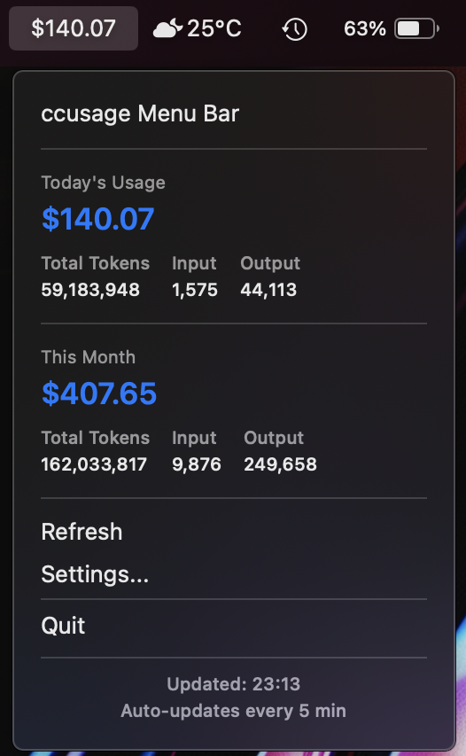
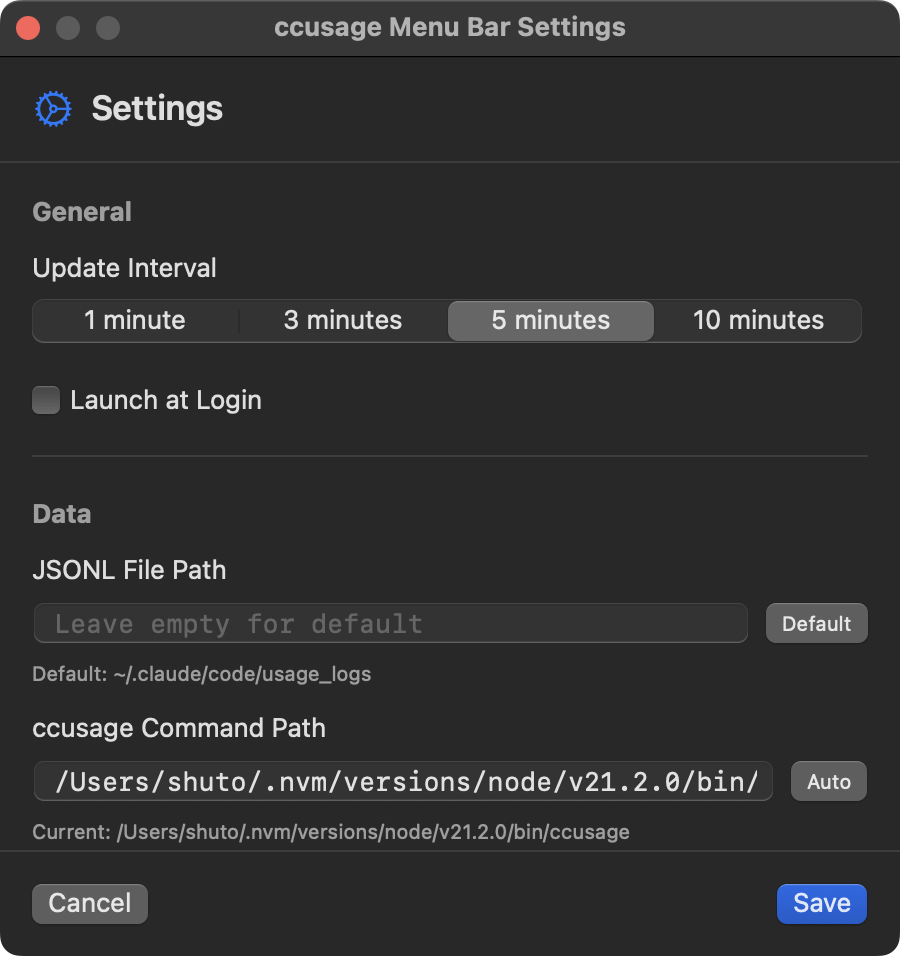

# ccusage Menu Bar

A macOS menu bar application that displays Claude Code usage and costs using [ccusage](https://github.com/ryoppippi/ccusage).



## Features

- 💵 Real-time display of today's Claude Code costs in the menu bar (e.g., "$54.51")
- 📊 Monthly cost and token usage tracking with detailed breakdown
- 🔄 Configurable automatic refresh intervals (1, 3, 5, or 10 minutes)
- ⚙️ Settings screen for customization
- 🚀 Launch at login support
- 📍 Custom path configuration for ccusage and JSONL files
- 🛡️ Comprehensive error handling with user-friendly messages
- 🎯 Native macOS app using SwiftUI and MenuBarExtra API

## Requirements

- macOS 13.0 or later
- Node.js installed
- [ccusage](https://github.com/ryoppippi/ccusage) installed (`npm install -g ccusage`)
- Claude Code usage data (stored in `~/.claude/code/usage_logs/`)

## Installation

### Download Release

1. Download the latest release from the [Releases](https://github.com/shutosg/ccusage-menu-bar-extra/releases) page
2. Open the DMG file and drag the app to your Applications folder
3. Launch the app from Applications

### Build from Source

1. Clone this repository:

   ```bash
   git clone https://github.com/shutosg/ccusage-menu-bar-extra.git
   cd ccusage-menu-bar-extra
   ```

2. Build the release version:

   ```bash
   ./build-release.sh
   ```

3. The built app will be in `CCUsageMenuBar/release/ccusage Menu Bar.app`

## Usage

### Basic Usage

1. The app displays today's cost in the menu bar (e.g., "$12.34")
2. Click the cost to view detailed usage information:
   - Today's usage breakdown (total tokens, input/output)
   - This month's usage summary
3. Click "Refresh" to manually update the data
4. Access "Settings..." to configure the app

### Settings

- **Update Interval**: Choose between 1, 3, 5, or 10 minutes
- **Launch at Login**: Automatically start the app when you log in
- **JSONL File Path**: Specify a custom path for Claude Code usage logs (default: `~/.claude/code/usage_logs`)
- **ccusage Command Path**: Specify a custom path for the ccusage command (auto-detected by default)

### Error Handling

The app provides clear error messages for common issues:

- **ccusage not installed**: "Please install via: npm install -g ccusage"
- **Node.js missing**: "Please install Node.js first"
- **Permission issues**: "Try reinstalling ccusage with sudo"
- Automatic retry for temporary failures
- Auto-pause updates after repeated errors

## Development

### Project Structure

```text
CCUsageMenuBar/
├── Package.swift              # Swift Package Manager configuration
├── CCUsageMenuBar/
│   ├── CCUsageMenuBarApp.swift    # Main app entry point
│   ├── Services/
│   │   └── CCUsageService.swift    # ccusage command execution
│   ├── ViewModels/
│   │   └── MenuBarViewModel.swift  # Business logic
│   ├── Views/
│   │   ├── MenuContentView.swift   # Menu dropdown content
│   │   ├── SettingsView.swift      # Settings screen
│   │   └── MonthlyReportView.swift # Monthly report display
│   └── Models/
│       ├── CCUsageData.swift       # Data models
│       └── AppSettings.swift       # Settings persistence
```

### Building

```bash
# Debug build
cd CCUsageMenuBar
swift build

# Release build
cd ..
./build-release.sh
```

### Key Technologies

- **Swift 5.9+** with Swift Package Manager
- **SwiftUI** for UI
- **MenuBarExtra** API (macOS 13+)
- **async/await** for asynchronous operations
- **UserDefaults** for settings persistence
- **SMAppService** for launch at login

## Troubleshooting

### ccusage not found

- Ensure ccusage is installed: `npm install -g ccusage`
- Check if Node.js is installed: `node --version`
- Try specifying the ccusage path in Settings

### No data displayed

- Verify Claude Code has been used today
- Check if usage logs exist in `~/.claude/code/usage_logs/`
- Try manual refresh or restart the app

## License

MIT License - see [LICENSE](LICENSE) file for details

## Acknowledgments

- [ccusage](https://github.com/ryoppippi/ccusage) by ryoppippi for the Claude usage analysis tool
- Built with SwiftUI and Swift Package Manager
- Uses MenuBarExtra API introduced in macOS 13

## Screenshots

### Menu Bar and Dropdown


The app displays today's cost in the menu bar (e.g., "$140.07"). Click to view:

- Today's usage breakdown with total tokens, input, and output
- This month's cumulative usage and costs
- Quick access to refresh and settings
- Auto-update status and interval

### Settings Screen



Configure your preferences:

- **Update Interval**: Choose between 1, 3, 5, or 10 minutes
- **Launch at Login**: Automatically start when you log in
- **JSONL File Path**: Specify custom path for Claude Code usage logs
- **ccusage Command Path**: Set custom ccusage installation path or use auto-detect
